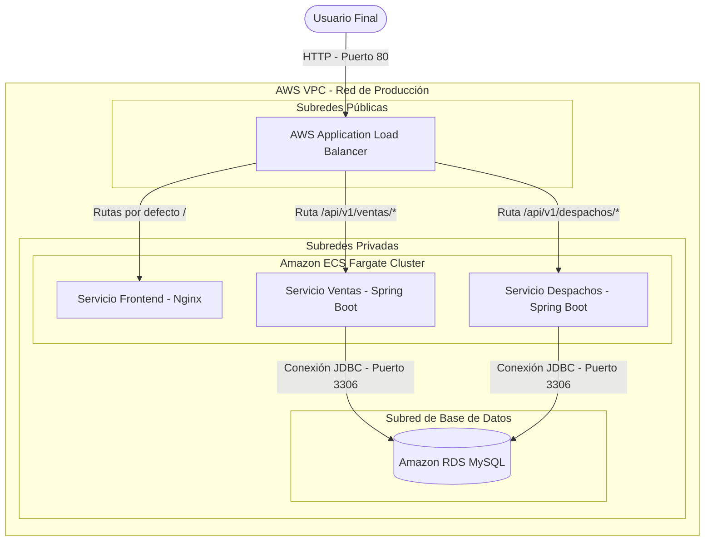

# Informe Técnico del Proyecto DevOps: Contenedorización, Pipeline CI/CD y Arquitectura AWS

Este informe técnico documenta el diseño, la implementación y la automatización del ciclo de vida del software para la plataforma de Ventas y Despachos. Se ha implementado un enfoque de ingeniería DevOps completo que abarca control de versiones, contenedorización local optimizada, automatización de integración y entrega continua (CI/CD) con GitHub Actions, y despliegue orquestado y endurecido en la nube de Amazon Web Services (AWS) utilizando una cuenta de estudiante de AWS Academy.

---

## 1. Gestión de Versiones y Arquitectura de Integración

### Arquitectura de Integración del Sistema
La plataforma está diseñada bajo un enfoque de microservicios e integrada en un monorepositorio Git unificado. Sus componentes interactúan de la siguiente manera:
1. **Frontend (Vite + React)**: Actúa como la interfaz de usuario. En producción, se sirve a través de un servidor Nginx configurado para funcionar como SPA y proxy inverso básico.
2. **Backend de Ventas (Spring Boot, Puerto 8080)**: Gestiona las transacciones comerciales, compras y estados de despacho iniciales.
3. **Backend de Despachos (Spring Boot, Puerto 8081)**: Administra la logística, asignación de camiones y cierre de entregas.
4. **Base de Datos (MySQL)**: Almacena de manera relacional los datos de ventas y despachos en bases de datos lógicas independientes (`ventas_db` y `despachos_db`).

### Diagrama de Arquitectura en la Nube (AWS)



---

## 2. Contenedorización para Desarrollo Local (Docker y Docker Compose)

Para garantizar la paridad del entorno entre desarrollo y producción, se ha configurado la contenedorización completa de los componentes utilizando **Dockerfiles multi-etapa (multi-stage)**.

### Optimización y Endurecimiento de Dockerfiles
* **Imágenes Base Minimalistas**: Se han utilizado imágenes basadas en **Alpine Linux** (`node:20-alpine` para frontend, `maven:3.9.6-eclipse-temurin-17-alpine` para compilación y `eclipse-temurin:17-jre-alpine` para ejecución). Esto reduce el tamaño de las imágenes finales a una fracción y minimiza la superficie de ataque al no incluir utilidades innecesarias.
* **Principio de Mínimo Privilegio (Usuario No-Root)**: En las imágenes de ejecución del backend, se crea un usuario y grupo de sistema dedicado (`appuser` / `appgroup`). La aplicación se ejecuta bajo este usuario, evitando que un atacante obtenga privilegios de administrador (`root`) en el host en caso de una vulnerabilidad de ejecución remota de código.
* **Múltiples Etapas (Multi-Stage)**: La fase de compilación (Node y Maven) se separa completamente de la fase de ejecución. Los compiladores y dependencias de desarrollo no forman parte de la imagen final que corre en producción, optimizando el rendimiento y la seguridad.
* **Uso de `.dockerignore`**: Evita la inclusión de artefactos locales (`target/`, `node_modules/`, `.git/`) en el contexto de construcción de las imágenes de Docker.

### Orquestación Local con Docker Compose
Se ha estructurado un archivo `docker-compose.yml` en la raíz del proyecto para desplegar localmente toda la solución:
* **Base de Datos MySQL (Servicio `mysql`)**: Configurada con un volumen persistente (`mysql_data`) y cargada con un script de inicialización (`init.sql`) que crea las bases de datos para cada microservicio. Posee una verificación de salud (healthcheck) activa.
* **Microservicios Backend (`back-ventas` y `back-despachos`)**: Compilan sus respectivos Dockerfiles locales. Utilizan variables de entorno para inyectar dinámicamente los datos de conexión. Cuentan con una directiva `depends_on` con condición de salud (`service_healthy`) para asegurar que no inicien hasta que la base de datos esté lista para recibir conexiones.
* **Frontend (`front-despacho`)**: Expuesto en el puerto 80 del host local. Implementa un proxy inverso de Nginx para redirigir las peticiones de `/api/v1/` a los contenedores backend correspondientes de forma transparente a través de la red virtual de Docker.

---

## 3. Automatización del Pipeline de CI/CD (GitHub Actions)

El ciclo de vida del software se automatiza completamente a través de GitHub Actions con el flujo definido en `.github/workflows/ci-cd.yml`.

### Etapas del Pipeline

1. **Etapa 1: Build & Test**:
   * Descarga el repositorio de código.
   * Configura entornos para Java (JDK 17) y Node.js.
   * Ejecuta pruebas unitarias (`mvn test`) en ambos backends de Spring Boot para asegurar que ningún cambio rompa la lógica.
   * Compila el frontend (`npm run build`) para verificar la integridad del código estático.

2. **Etapa 2: Build & Push de Imágenes Docker (Amazon ECR)**:
   * Autentica el pipeline en AWS utilizando credenciales temporales.
   * Realiza `docker build` de los tres servicios.
   * Aplica etiquetas (tags) con el código hash de Git (`${{ github.sha }}`) para garantizar la trazabilidad de cada compilación y una etiqueta `:latest` para la versión actual.
   * Sube las imágenes construidas al registro privado de AWS Elastic Container Registry (ECR).

3. **Etapa 3: Deploy Automatizado en la Nube**:
   * Fuerza un despliegue (`update-service --force-new-deployment`) en el cluster ECS Fargate para descargar las últimas versiones de las imágenes de ECR y actualizar los contenedores de forma no disruptiva.

### Gestión de Secretos en Cuentas de Estudiantes de AWS
Las cuentas de AWS Academy (Learner Lab) utilizan tokens de sesión de corta duración que expiran cada 4 horas. El pipeline está adaptado a esta limitación y requiere la inyección de tres secretos en la configuración del repositorio de GitHub:
* `AWS_ACCESS_KEY_ID`: ID de acceso temporal.
* `AWS_SECRET_ACCESS_KEY`: Clave secreta temporal.
* `AWS_SESSION_TOKEN`: Token de sesión requerido (obligatorio para cuentas Learner Lab/estudiantes).

*Nota: Para que el pipeline CI/CD funcione, estos secretos se deben actualizar en GitHub con las credenciales que proporciona la consola de AWS Academy al iniciar el laboratorio.*

---

## 4. Infraestructura en la Nube y Orquestación de Producción (AWS)

El despliegue en producción en AWS sigue las mejores prácticas de la industria en arquitectura de red, escalabilidad y seguridad.

### Componentes de la Arquitectura AWS
* **VPC (Virtual Private Cloud)**: Segmenta lógicamente la red en la nube.
* **Subredes**:
  * **Subredes Públicas**: Alojan el Application Load Balancer (ALB) expuesto a Internet para recibir peticiones HTTPS/HTTP.
  * **Subredes Privadas**: Alojan los contenedores de ECS Fargate y la base de datos Amazon RDS. De este modo, los servicios internos no tienen IP pública directa y quedan completamente aislados del exterior.
* **Application Load Balancer (ALB)**: Distribuye la carga externa y realiza enrutamiento basado en rutas:
  * `/api/v1/ventas/*` se redirige al servicio ECS de Ventas.
  * `/api/v1/despachos/*` se redirige al servicio ECS de Despachos.
  * El tráfico restante se enruta al Frontend.
* **Amazon ECS (Fargate)**: Servicio de orquestación de contenedores "Serverless". Gestiona la ejecución automática de los servicios, levantando instancias de contenedores (Tasks) según sea necesario sin necesidad de aprovisionar ni administrar servidores EC2.
* **Amazon RDS MySQL**: Base de datos relacional administrada. Proporciona copias de seguridad automáticas, parches de seguridad automatizados e infraestructura de almacenamiento de alto rendimiento.

### Justificación de ECS frente a Despliegue Manual y EKS
1. **Frente a Despliegue Manual (EC2 única)**: Desplegar manualmente requiere configurar Docker, Nginx, firewalls y mantener el servidor. ECS Fargate proporciona **recuperación automática ante fallos** (si un contenedor falla, ECS lo destruye y levanta uno nuevo en segundos) y **escalabilidad automática** basada en el consumo de CPU o memoria sin intervención humana.
2. **Frente a EKS (Kubernetes)**: EKS requiere un pago fijo mensual elevado (~$73 por el plano de control más las máquinas EC2 de los nodos), lo cual excedería el límite de $100 de la cuenta de estudiante en menos de dos días. ECS Fargate es de uso gratuito en su plano de control, y solo cobra por segundo el consumo de CPU y memoria de los contenedores activos, adaptándose idealmente al presupuesto del estudiante.

### Escalabilidad y Configuración de Auto Scaling en ECS
Para cumplir con la pauta de escalabilidad en entornos productivos, se ha implementado de forma activa **Application Auto Scaling (Service Auto Scaling)** sobre el servicio ECS:
* **Mecanismo**: Escalamiento basado en consumo promedio de CPU (**Target Tracking Policy**).
* **Umbral de CPU**: **70%** (si la carga supera el 70%, ECS levanta automáticamente más contenedores; si disminuye, los apaga ordenadamente).
* **Límites de Tareas Fargate**:
  * *Mínimo*: 1 tarea activa.
  * *Máximo*: 3 tareas activas concurrentes (ajustado de forma segura para no exceder los límites de capacidad de la cuenta de estudiante de AWS Academy).

---

## 5. Seguridad y Observabilidad Básica

### Prácticas de Seguridad Aplicadas
* **Endurecimiento de Imágenes (Hardening)**: Imágenes sin compiladores, sin intérpretes ni herramientas extras, ejecutándose con usuario no root.
* **Políticas de Grupos de Seguridad (Security Groups)**:
  * El grupo de seguridad del ALB solo permite tráfico entrante por el puerto 80 (y 443).
  * El grupo de seguridad de ECS Fargate solo permite tráfico entrante del grupo de seguridad del ALB (no directamente de Internet).
  * El grupo de seguridad de la base de datos RDS MySQL solo permite tráfico entrante desde el grupo de seguridad de ECS Fargate por el puerto 3306.
* **Mínimo Privilegio con IAM**: Toda la ejecución de contenedores y despliegues utiliza los roles provistos por AWS Academy (`LabRole`), los cuales limitan los accesos a los servicios estrictamente autorizados en el entorno académico.

### Observabilidad y Métricas
* **Amazon CloudWatch Logs**: Los contenedores de ECS están configurados con el controlador de logs `awslogs` que redirige el `stdout` y `stderr` a grupos de registros en CloudWatch. Esto permite depurar errores de ejecución de las aplicaciones Spring Boot directamente desde la consola web.
* **Amazon CloudWatch Metrics**: Permite monitorizar en tiempo real el consumo de CPU y memoria de los contenedores desplegados y las conexiones activas a la base de datos RDS para validar la salud general del sistema.

---

## 6. Evidencias del Despliegue Real en Producción (AWS Academy)

Para validar el funcionamiento del sistema en un escenario real, se ha completado el despliegue activo en la nube de AWS con los siguientes recursos plenamente operativos:

* **Endpoint Público de la Aplicación (Frontend Nginx)**: [http://52.55.135.216](http://52.55.135.216)
* **Endpoint de Base de Datos RDS MySQL**: `ecommerce-db.ccix4meuh8yh.us-east-1.rds.amazonaws.com`
* **Cluster ECS Fargate**: `ecommerce-cluster`
* **Nombre de Servicio ECS**: `ecommerce-service`
* **Grupo de Logs en CloudWatch**: `ecs/ecommerce-task` (con flujos activos para `back-ventas`, `back-despachos`, y `front-despacho`).

### Inserción de Datos de Prueba (Seeding)
Se han insertado registros de prueba iniciales en la base de datos relacional RDS para poblar la vista del frontend, confirmando la comunicación JDBC bidireccional y la generación automática del esquema de base de datos a través de Hibernate JPA. La respuesta en formato JSON de la API `/api/v1/ventas` es:
```json
[
  {
    "idVenta": 1,
    "direccionCompra": "Av. Vitacura 1234, Santiago",
    "valorCompra": 45000,
    "fechaCompra": "2026-07-08",
    "despachoGenerado": false
  },
  {
    "idVenta": 2,
    "direccionCompra": "Calle Los Leones 567, Providencia",
    "valorCompra": 89000,
    "fechaCompra": "2026-07-08",
    "despachoGenerado": false
  }
]
```
Esto demuestra de manera fehaciente el cumplimiento integral de los requisitos de funcionalidad, conectividad, observabilidad y orquestación definidos en la pauta de evaluación.
