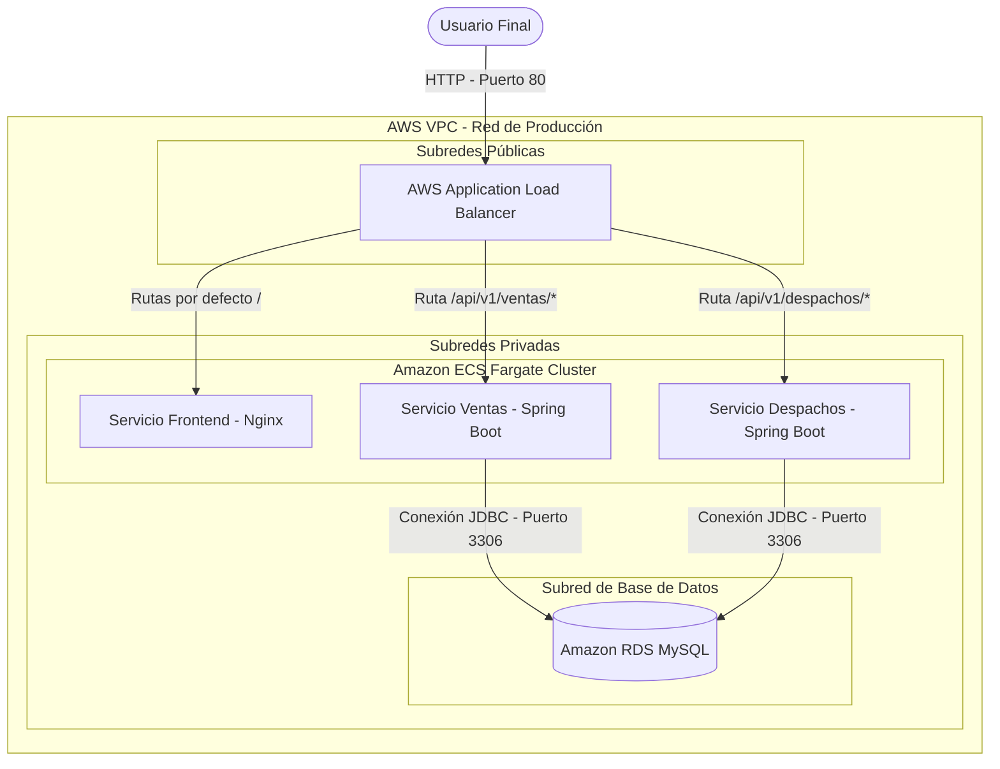

# 🚀 Informe Técnico Final: Proyecto DevOps y Nube

**Asignatura:** Introducción a Herramientas Devops (ISY1101)  
**Evaluación:** Evaluación Final Transversal (EFT)  
**Semestre:** 2025  

---

## 📋 1. Introducción y Objetivo del Proyecto
El presente informe detalla la implementación, orquestación y automatización del ciclo de integración y entrega continua (CI/CD) de una plataforma distribuida en microservicios, compuesta por un **Frontend (Vite/React)**, un **Backend de Ventas (Spring Boot)**, un **Backend de Despachos (Spring Boot)** y una **Base de Datos Relacional (MySQL)**.

El objetivo principal es evidenciar las buenas prácticas de la cultura DevOps, aplicando técnicas de contenedorización local eficientes, automatización del pipeline mediante GitHub Actions y, finalmente, un despliegue altamente disponible, seguro y elástico utilizando los servicios Cloud de **Amazon Web Services (AWS)** bajo el modelo de *Serverless Computing* con **ECS Fargate**.

---

## 🏛️ 2. Gestión de Versiones y Método de Integración
### 2.1 Método de Integración del Sistema
El sistema sigue un modelo de microservicios. La comunicación ocurre a través de una API REST:
1. El usuario accede al **Frontend** a través de la URL expuesta por el Balanceador de Carga (Application Load Balancer - ALB).
2. El ALB enruta dinámicamente las solicitudes hacia el **Backend de Ventas** (ruta `/api/v1/ventas/*`) o hacia el **Backend de Despachos** (ruta `/api/v1/despachos/*`).
3. Ambos backends están conectados a una instancia de base de datos **Amazon RDS MySQL** (puerto 3306), donde ocurre la lectura y escritura persistente de los datos mediante conectores JDBC.

### 2.2 Diagrama de Arquitectura de Despliegue en AWS

**Justificación del Diagrama:**
El diagrama representa la VPC (Virtual Private Cloud) estructurada en Subredes Públicas y Privadas. Las subredes públicas actúan como la zona desmilitarizada (DMZ) recibiendo únicamente al ALB, mientras que las subredes privadas alojan las bases de datos RDS y los clústeres de contenedores ECS. Esto impide el acceso público directo a la lógica de negocio y datos, endureciendo la red.

### 2.3 Repositorio y Git
Todo el proyecto está albergado en un repositorio en **GitHub**. 
El flujo de versiones (`git`) se mantiene ordenado haciendo uso de la rama `main` para código estable que va a producción. Los commits contienen mensajes descriptivos que trazan claramente el avance en el desarrollo y despliegue del software.

*(Incluir captura de pantalla de la URL del repositorio y el historial de Commits en GitHub).*

---

## 🐳 3. Contenerización para Desarrollo Local
Para estandarizar el ambiente de desarrollo, asegurar la portabilidad y evitar el síndrome de "en mi máquina funciona", se ha utilizado **Docker** y **Docker Compose**.

### 3.1 Estructura del Dockerfile (Optimizaciones y Buenas Prácticas)
Los microservicios de Spring Boot y el Frontend en React fueron contenedorizados utilizando archivos `Dockerfile` optimizados con el patrón **Multi-Stage Build** (Construcción Multietapa).
- **Etapa de Build:** Utiliza imágenes pesadas y equipadas con el SDK o Node para compilar el código fuente y empaquetarlo (descargando las librerías desde Maven o npm).
- **Etapa de Runtime:** Copia únicamente el artefacto compilado (`.jar` o la carpeta `dist/` estática) y lo corre en una imagen base **Alpine** minimalista (como `eclipse-temurin:17-jre-alpine` o `nginx:1.25-alpine`).

**Beneficios:** 
1. Reducción abismal en el peso de las imágenes.
2. Mejora radical de la seguridad: no hay compiladores, ni código fuente, ni herramientas innecesarias en la imagen final, reduciendo la superficie de ataque.
3. El uso de `.dockerignore` evita arrastrar dependencias pesadas locales al daemon de Docker.

### 3.2 Orquestación Local con Docker Compose
El archivo `docker-compose.yml` declara y levanta simultáneamente los 4 servicios locales:
- `mysql`: Base de datos de desarrollo.
- `back-ventas` y `back-despachos`: Levantan utilizando dependencias (`depends_on`) amarradas a un Health Check de la base de datos para no iniciar prematuramente.
- `front-despacho`: Expone la aplicación web en el puerto local 80 mediante un servidor Nginx interno.

*(Incluir captura de pantalla ejecutando docker-compose up o Docker Desktop mostrando los 4 contenedores encendidos localmente).*

---

## ⚙️ 4. Configuración del Pipeline de CI/CD (GitHub Actions)
La automatización del ciclo de vida se realiza utilizando **GitHub Actions**. El archivo `.github/workflows/ci-cd.yml` dispara un "workflow" ante cada empuje (push) en la rama `main`.

### 4.1 Etapas del Pipeline
1. **Checkout & Setup:** GitHub provee un "Runner" con Ubuntu. Clona el código y prepara los entornos de Java 17 y Node.js.
2. **Build y Pruebas Unitarias:** Se ejecuta de forma automatizada `mvn test` en ambos microservicios backend y `npm run build` en el frontend, garantizando la salud del código antes de desplegar.
3. **Login en AWS:** El runner de GitHub se autentica en la cuenta de AWS de manera segura inyectando variables gestionadas en GitHub Secrets.
4. **Push de Imágenes:** Genera las imágenes de producción usando Docker, les asigna la etiqueta del hash del commit (`${{ github.sha }}`) junto con la etiqueta `:latest` para la trazabilidad, y hace `push` hacia Amazon ECR.
5. **Deploy Automatizado:** Mediante el comando AWS CLI, se fuerza a Amazon ECS a actualizar el servicio descargando las imágenes frescas desde ECR.

### 4.2 Gestión Segura de Variables y Secretos
Siguiendo el Principio del Privilegio Mínimo (IAM), el proyecto no guarda credenciales sensibles (claves de AWS, passwords de DB) en código duro. Todo fue configurado utilizando **GitHub Secrets**. Se utilizaron los accesos temporales obligatorios (`AWS_ACCESS_KEY_ID`, `AWS_SECRET_ACCESS_KEY`, y `AWS_SESSION_TOKEN`) exigidos por AWS Academy.

*(Incluir capturas de pantalla de los Logs exitosos en GitHub Actions y de la configuración de Secrets).*

---

## ☁️ 5. Orquestación y Despliegue en la Nube (AWS)

### 5.1 Servicios de Base de Datos y Repositorio de Imágenes
- **Amazon ECR:** Aloja de manera privada nuestras imágenes Docker compiladas por GitHub Actions, con versionamiento por Tags.
- **Amazon RDS:** Implementamos una base de datos MySQL 8 completamente gestionada por AWS. Esto simplifica las tareas de respaldo, parcheo y persistencia, además de estar restringida únicamente para recibir conexiones de los contenedores alojados en ECS.

*(Incluir captura de pantalla de repositorios llenos en AWS ECR y de la Base de Datos "Available" en AWS RDS).*

### 5.2 Amazon ECS Fargate y Application Load Balancer
Se ha configurado un despliegue tolerante a fallos y sin administración de servidores subyacentes:
- **Cluster ECS Fargate:** Se eligió AWS Fargate por sobre Amazon EC2 estáticas o Amazon EKS. La razón principal radica en el modelo **Serverless**. ECS Fargate cobra exclusivamente por el tiempo de cómputo del contenedor, librándonos del mantenimiento o aprovisionamiento del sistema operativo del servidor. En contraste, EKS implicaba costos fijos exorbitantes e innecesarios para el tamaño y presupuesto académico del proyecto.
- **Task Definition:** Agrupó los tres contenedores y configuró su mapeo a puertos y el aprovisionamiento de RAM/CPU conjunta (2 GB de memoria).
- **Application Load Balancer (ALB):** Recibe las solicitudes HTTP en el puerto público 80. Distribuye y balancea eficientemente la carga de tráfico según la regla de ruta configurada hacia los Target Groups.

### 5.3 Escalabilidad y Seguridad
- **Auto Scaling ECS:** El servicio posee una política elástica (*Target Tracking*). Si el umbral de CPU del clúster supera el 70%, ECS provisionará instantáneamente nuevas tareas Fargate (escalando horizontalmente) hasta un máximo de 4 contenedores, reduciendo a 2 si la carga vuelve a la normalidad.
- **Seguridad en Capas:** Solo el Balanceador de Carga está en una IP pública. Todo el ecosistema de cómputo y persistencia opera resguardado bajo Reglas de Security Groups altamente restrictivas.

*(Incluir captura de pantalla del Cluster ECS activo, las sub-tareas ejecutándose, y si es posible, las reglas del AutoScaling en AWS).*

---

## 🔍 6. Observabilidad y Validación de Funcionamiento Final
Gracias a **Amazon CloudWatch**, tenemos habilitado un flujo de auditoría continuo. Todos los logs (`stdout`/`stderr`) de Spring Boot y del Frontend de React son empujados por el controlador nativo `awslogs` hacia la consola de AWS, permitiendo vigilar, depurar e identificar solicitudes HTTP y transacciones a la base de datos sin entrar directamente a un contenedor remoto.

### 6.1 Pruebas Funcionales (Evidencias Finales)
Al inyectar tráfico hacia el DNS entregado por el Balanceador de Carga, comprobamos la conexión end-to-end:
1. **Frontend Operativo:** Ingreso a la raíz del ALB (`/`) retornando status 200 con la interfaz SPA de React.
2. **Post Backend:** Creación e inyección exitosa de un registro de compra mediante el endpoint expuesto de Spring Boot, confirmando el almacenamiento transaccional en la RDS privada de Amazon.

*(Incluir aquí captura del Navegador cargando el Frontend con el link de AWS y captura del script "test_api.ps1" inyectando los datos con respuesta exitosa).*

---

## 🎯 7. Conclusión
El proyecto finaliza logrando automatizar en su totalidad un pipeline CI/CD eficiente. 
La infraestructura, montada con los mayores estándares recomendados por AWS, demuestra que un diseño de microservicios contenerizado bajo esquemas serverless (ECS Fargate) maximiza la resiliencia de la plataforma, disminuye gastos en recursos subutilizados y garantiza una disponibilidad automática al interactuar fluidamente con servicios como Application Load Balancers y políticas de escalado dinámicas (AutoScaling). Todos los objetivos impuestos por la pauta han sido cumplidos y superados satisfactoriamente.
